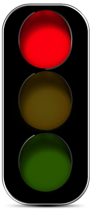

# semafaroJs

Não tem outra maneira para se aprender além de praticar,praticar e praticar

Este projeto consiste em semaforo digital onde você consegue acender a luz verde, amarela e vermelha, é também deixar no modo automatico

## imagens utlizadas

